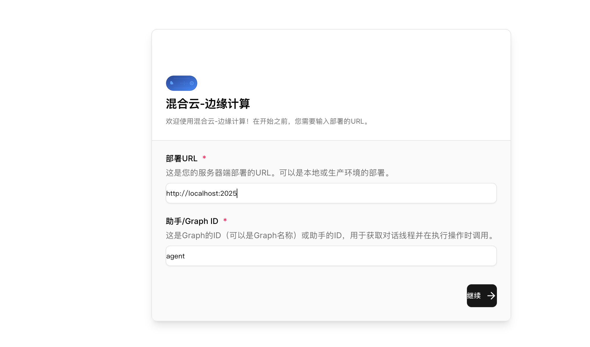
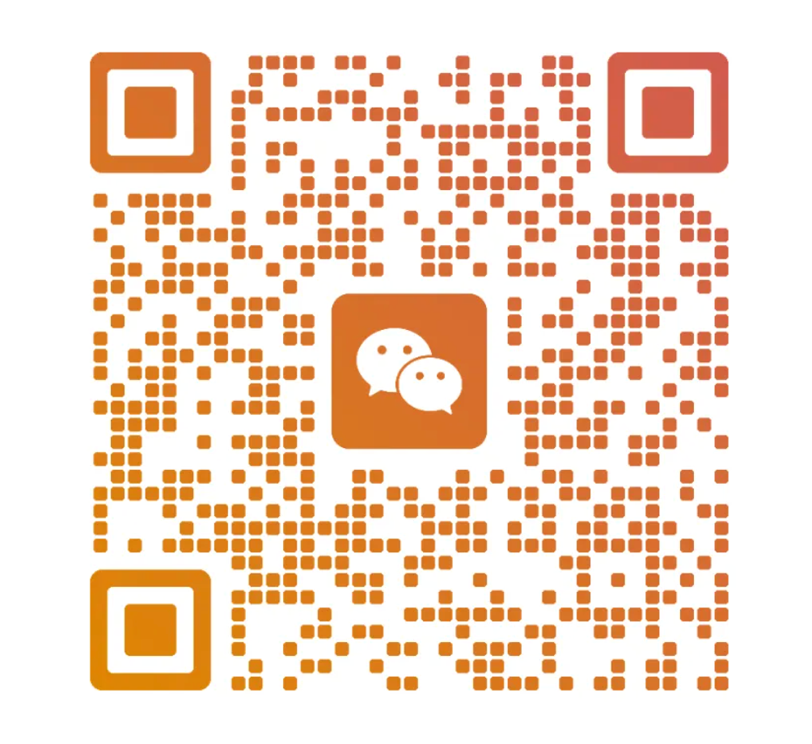

# LangGraph 教学项目

## 项目简介

这是一个基于 LangGraph 框架的教学项目，旨在帮助开发者学习和掌握 LangGraph 的核心概念与实践应用。项目通过循序渐进的示例，展示了从基础工具构建到复杂 RAG 系统的完整开发流程。

## 🚀 快速开始

### 启动 Agent 聊天界面

本项目包含一个交互式的演示前端，让您能够直观地体验 LangGraph 的功能。

#### 配置步骤

1. **配置 Agent**
   
   在 `graph.json` 文件中配置您的 agent：
   
   ```json
   {
     "dependencies": ["."],
     "graphs": {
       "agent": {
         "path": "./src/anything_rag_server/agent_rag_async.py:agent"
       }
     },
     "env": ".env",
     "image_distro": "wolfi"
   }
   ```

2. **启动后端服务**
   
   运行启动脚本：
   ```bash
   python start_server.py
   ```

3. **启动前端界面**
   
   进入前端目录并启动开发服务器：
   ```bash
   cd agent_chat_ui
   npm run dev
   ```

4. **开始使用**
   
   界面启动后，您将看到如下界面：
   
   
   
   点击"继续"按钮即可开始对话：
   
   

## 📚 学习路径

本项目的学习内容由浅入深，建议按照以下顺序进行学习：

### 第一阶段：基础概念
**Agent、Tool 和 MCP 入门**
- 📁 学习路径：`src/ui_test_demo/`
- 🎯 学习目标：理解 LangGraph 的基本组件和工具使用

### 第二阶段：核心模式
**ReAct 模式实践**
- 📁 学习路径：`src/ReAct_demo/`
- 🎯 学习目标：掌握推理-行动循环的核心思想

### 第三阶段：工作流设计
**Graph 架构设计**
- 📁 学习路径：`src/graphs_examples/`
- 🎯 学习目标：学会设计和实现复杂的工作流程

### 第四阶段：RAG 系统
**检索增强生成**
- 📁 多模态文档解析：`src/file_agent/`
- 📁 工程化实践：`src/file_rag/`
- 📁 智能检索：`src/agentic_rag/`
- 🎯 学习目标：构建完整的文档问答系统

### 第五阶段：rag项目实战（前端+后端+对话）
**完整系统开发**
- 📁 项目示例：`easy_rag_server/`
- 🎯 学习目标：将 RAG 技术应用到实际项目中

### 第六阶段：架构优化（rag 封转成 mcp）
**MCP + Agent 模式**
- 📁 基础实现：`src/rag_chat/`
- 📁 高级封装：`src/mcp_server_rag/`
- 🎯 学习目标：掌握现代化的 AI 系统架构设计

### 第七阶段：实践项目（将 anything_rag的官方文档跑通封装）
**企业级应用**
- 📁 生产方案：`src/anything_rag_server/`
- 📖 详细文档：项目内 README 文件
- 🎯 学习目标：了解如何将 demo 转化为生产级应用

### 第八阶段：rag 生产级项目 （lightrag+anythingrag）
**anything_chat_rag - 基于 LightRAG 的完整 RAG 应用**
- 📁 项目路径：`anything_chat_rag/`
- 🎯 学习目标：学习一个基于 LightRAG 构建的完整 RAG 系统，包含文件上传、解析、检索和对话功能
- ✨ 主要特点：
  - 支持多模态文档处理（PDF、Office文档、图片等）
  - 集成 RAG-Anything 实现智能文档解析
  - 提供本地向量库存储支持
  - 包含前后端完整实现
  - 支持多种 LLM 和 Embedding 模型

### 第九阶段：Deep Agent 综合能力
**中断/子智能体/持久化后端/中间件/集成示例**
- 📁 目录：`src/deep_agent_demo/`
  - 中断 & 人为介入：`interrupt_agent/`
  - 研究型子智能体：`research_agent/`
  - 后端路由 & 长期记忆：`backends_demo/`, `long_term_memory_demo/`
  - 子智能体模式：`subagents_demo/`
  - 默认中间件自定义：`middleware_demo/`
  - 综合集成示例：`integrated_agent_demo/agent.py`（本地运行），`integrated_agent_demo/agent_api.py`（LangGraph API 部署，使用平台持久化）
- 🎯 学习目标：掌握 Deep Agent 的规划/文件系统/子智能体/持久化路由组合，以及 MCP 搜索（需 `zhipu_search_mcp_url` 环境变量）与 `HumanMessage.pretty_print` 对话打印。

### 第十阶段：生产部署与容器化
**LangGraph/LangSmith 独立部署与运维**
- 📁 项目路径：根目录部署配置（`docker-compose.langgraph.yml`、`docker-compose.lb.yml`）
- 🎯 学习目标：掌握 LangGraph 项目的完整部署流程，包含容器化构建、服务编排和运维监控
- ✨ 主要特点：
  - 基于 LangGraph CLI 的镜像构建与部署
  - 支持独立服务器部署和负载均衡配置
  - 集成 Redis 消息队列和 PostgreSQL 数据存储
  - 提供健康检查和监控机制
  - 支持多实例扩展和高可用部署

部署要点：
- **环境准备**：使用 `langgraph dockerfile` 生成部署镜像，配置 `.env` 环境变量
- **核心配置**：`REDIS_URI`（消息队列）、`DATABASE_URI`（PostgreSQL）、`LANGSMITH_API_KEY`（API密钥）
- **部署模式**：
  - 单实例部署：`docker compose -f docker-compose.langgraph.yml up -d`
  - 负载均衡部署：`docker compose -f docker-compose.lb.yml up -d --scale langgraph-api=2`
- **健康检查**：`curl http://0.0.0.0:8123/ok` 返回 `{"ok":true}`
- **许可校验**：支持 `LANGGRAPH_CLOUD_LICENSE_KEY` 正式许可或 Lite 模式运行

技术特色：
- 使用 uv 管理 Python 3.13 虚拟环境，确保构建一致性
- 支持完全离线部署（需参考 air-gapped 文档）
- 提供 Beacon 服务访问用于许可校验和用量上报
- 支持多部署共用同一 Redis/PostgreSQL，通过 DB 编号和数据库名隔离

## 🏗️ 系统架构

### Easy RAG Server

一个功能完整的 RAG 后台管理系统，包含：
- ✅ 后台管理界面
- ✅ 前端交互界面  
- ✅ 对话系统
- 🔄 V2 版本开发中

### Anything Chat RAG

基于 LightRAG 的完整生产级 RAG 系统，提供企业级部署方案。

**核心能力：**
- 📚 **RAG知识库构建**：支持多模态文档上传、智能解析、向量化存储
- 🔍 **智能文档检索**：基于图结构的语义检索，支持混合查询模式
- 🤖 **Agent集成**：与LangGraph智能体无缝结合，支持工具调用和对话管理
- 🐳 **容器化部署**：完整的Docker支持，一键启动前后端服务

**应用场景：**
- 企业知识库问答系统
- 文档智能分析与检索
- 多模态内容理解与对话
- 生产级RAG服务部署

详细使用指南请参考：`anything_chat_rag/how_to_use.md`

## 🤝 技术交流

欢迎加入我们的技术交流群，与更多开发者一起学习进步：



---

**Happy Learning! 🎉**
