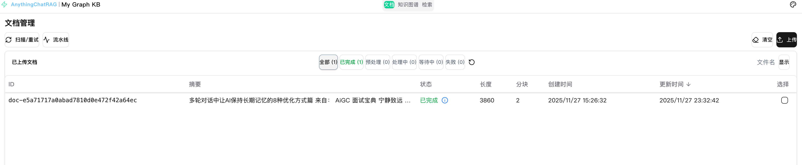
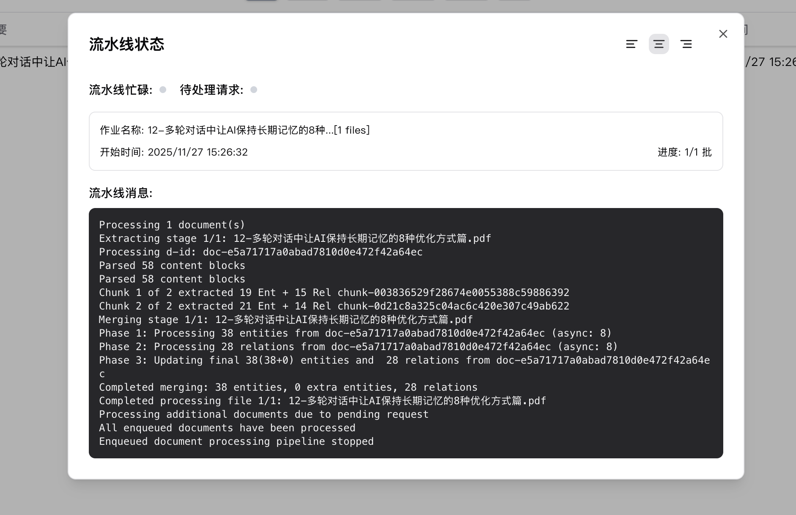
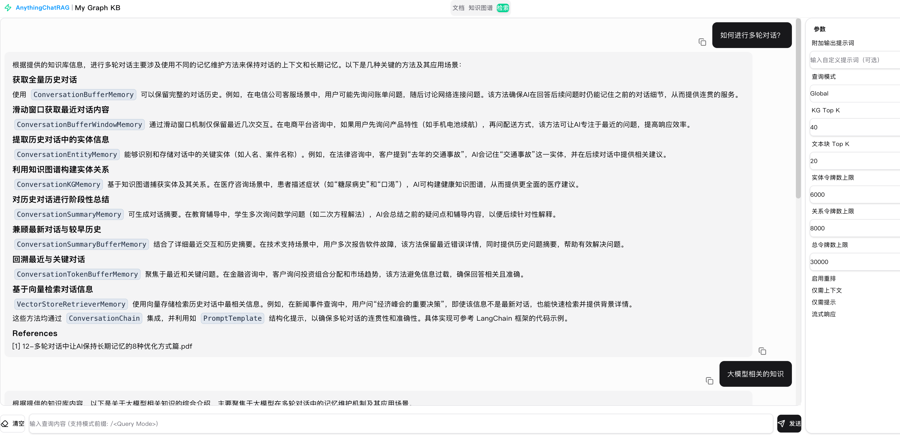
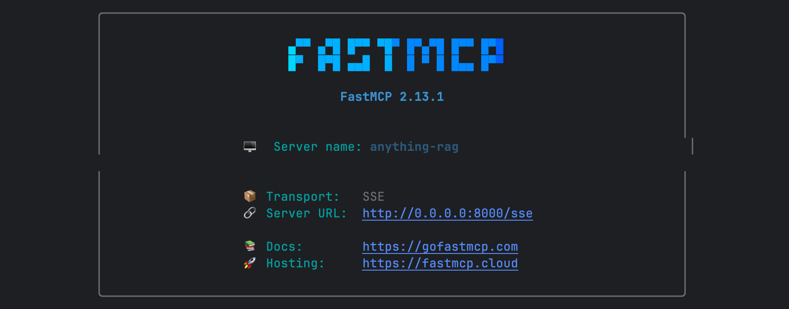
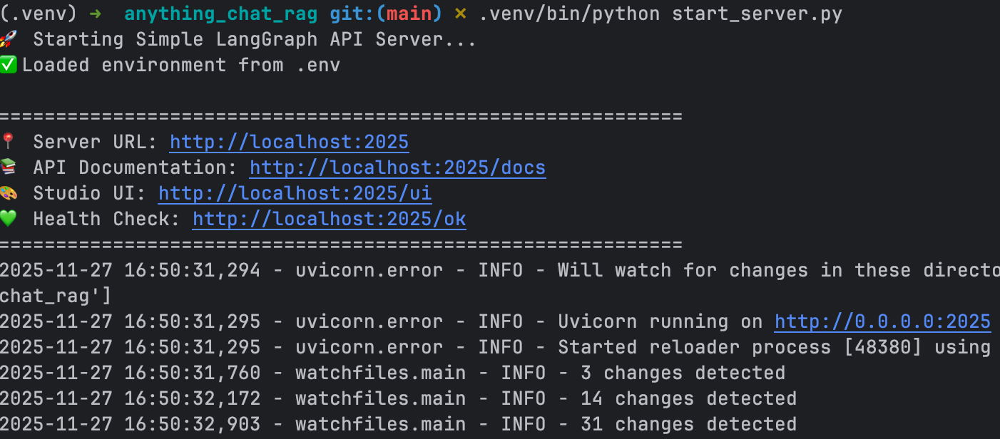
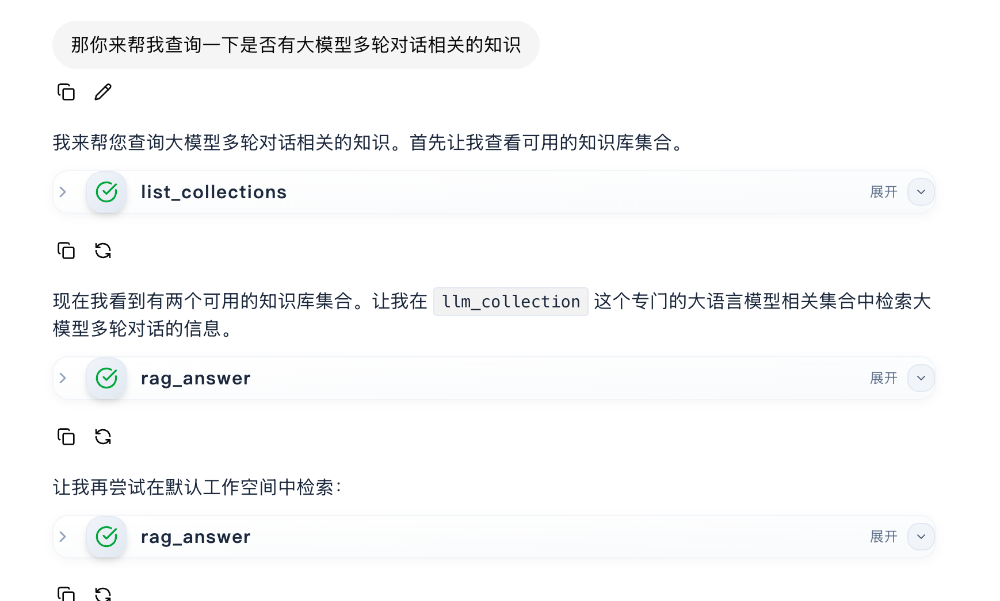
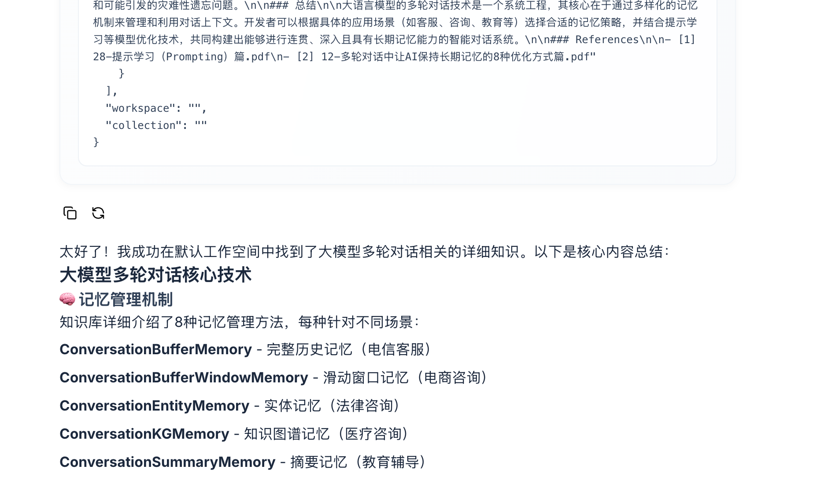

## 如何使用

## env修改

将`env.example`复制为`.env`
修改如下变量即可：（我们先配置最简单的形式)
```python
大语言模型：deepseek-chat
多模态模型：doubao
嵌入模型：ollama/qwen3-embedding:0.6b
向量数据库：JsonKVStorage（默认）

```

变量如下： 

···

```
LLM_BINDING=openai
LLM_MODEL=deepseek-chat
LLM_BINDING_HOST=https://api.deepseek.com/v1
LLM_BINDING_API_KEY=sk-26cb4xxxxxxxxx


VL_BINDING=openai
VL_MODEL=doubao-seed-1-6-251015
VL_BINDING_HOST=https://ark.cn-beijing.volces.com/api/v3
VL_BINDING_API_KEY=7ca93xxxxxxx

EMBEDDING_BINDING=ollama
EMBEDDING_MODEL=qwen3-embedding:0.6b
EMBEDDING_DIM=1024
EMBEDDING_SEND_DIM=false
EMBEDDING_TOKEN_LIMIT=8192
EMBEDDING_BINDING_HOST=http://{ip}:11434
EMBEDDING_BINDING_API_KEY=your_api_key

# 默认形式
############################
### Data storage selection
############################
### Default storage (Recommended for small scale deployment)
# LIGHTRAG_KV_STORAGE=JsonKVStorage
# LIGHTRAG_DOC_STATUS_STORAGE=JsonDocStatusStorage
# LIGHTRAG_GRAPH_STORAGE=NetworkXStorage
# LIGHTRAG_VECTOR_STORAGE=NanoVectorDBStorage
```


## 环境安装

```
uv venv --python 3.13 .venv
source .venv/bin/activate
uv sync
```


## 文件上传服务启动

安装好上面依赖后

```
lightrag-server
```


## 前端依赖安装

```
cd lightrag_webui

- 安装 Bun（macOS 推荐）：

    brew install oven-sh/bun/bun   # 或者：curl -fsSL https://bun.sh/install | bash
  - 确认 PATH（若用安装脚本）：在 ~/.zshrc 里确保有 export BUN_INSTALL="$HOME/.bun" 和
    export PATH="$BUN_INSTALL/bin:$PATH"，然后 source ~/.zshrc。
  - 验证：bun --version 正常输出后，在项目根目录执行：

    bun install
    bun run dev
```

其中之后会报错

```
PM [vite] http proxy error: /health
```

这种错误日志不用管


## 文件上传功能前后端展示


前端界面如下： 




可以查看文件处理进度




可以进行对话




## mcp启动

```
 .venv/bin/python src/anything_rag_server/server.py --sse --host 0.0.0.0 --port 8000

```




## langgraph server 启动

```
 .venv/bin/python start_server.py
```




## agent_chat_ui 启动

```
npm run dev 
```





