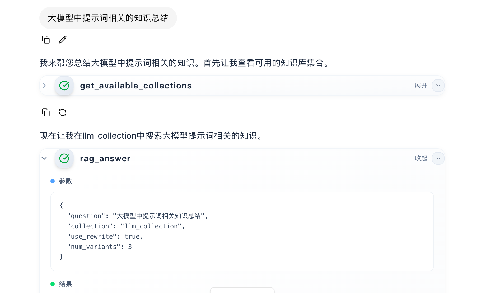

# Anything RAG Server & Agent

基于 **RAG-Anything + LightRAG（本地 rag_storage 向量库）** 的 FastMCP 服务与 LangGraph Agent。提供 RAG 工具、工作空间发现、以及文档导入脚本。

## 目录
- `server.py`：FastMCP 服务器，暴露 RAG 工具（rag_query_rewrite / rag_retrieve / rag_answer / rag_multi_query_search）
- `agent_rag.py` / `agent_rag_async.py`：LangGraph 1.0 Agent，同步/异步两种形态（推荐异步）
- `collections_tool.py`：`get_available_collections` 工具（扫描本地 rag_storage 工作空间，兼容 collections.json）
- `upload_document.py`：文档导入脚本，调用 RAG-Anything 写入本地 rag_storage

## 环境变量
核心：
- `DEEPSEEK_API_KEY` 或 `LLM_API_KEY`：LLM Key
- `DEEPSEEK_API_BASE` 或 `LLM_BASE_URL`：LLM Base URL
- `IMAGE_PARSER_MODEL` / `IMAGE_PARSER_API_BASE` / `IMAGE_PARSER_API_KEY`：可选 VLM
- `EMBEDDING_MODEL`，`EMBEDDING_BASE_URL`，`EMBEDDING_API_KEY`：Embedding 配置（Base URL 自动补 `/v1`）
- `RAG_WORKDIR` / `WORKING_DIR`：工作目录（默认项目根的 `rag_storage`）
- `RAG_PARSER`：`docling`（默认）或 `mineru`
- `RAG_PARSE_METHOD`：`auto|ocr|txt`（默认 `auto`）
- Agent 额外：`ANYTHING_RAG_MCP_URL`（默认 `http://127.0.0.1:8000/sse`），`ANYTHING_RAG_MCP_NAME`（默认 `anything-rag`）

## 启动 MCP 服务器
```bash
# stdio（默认）
.venv/bin/python src/anything_rag_server/server.py

# SSE
.venv/bin/python src/anything_rag_server/server.py --sse --host 0.0.0.0 --port 8000
```

## 使用 LangGraph Agent（推荐异步版）
```bash
# 请确保 MCP 服务已用 --sse 方式启动，并将 ANYTHING_RAG_MCP_URL 指向 SSE 地址（默认 http://127.0.0.1:8000/sse）

# 推荐：纯 async 版，适合全链路 async/ainvoke
python -m src.anything_rag_server.agent_rag_async

# 兼容：同步包装版（保留 _wrap_sync），适合需要 agent.invoke 的场景
python -m src.anything_rag_server.agent_rag
```
Agent 会：
1) 调用 get_available_collections（扫描 rag_storage 工作空间或 collections.json）
2) 通过 MCP 加载 RAG 工具（rag_query_rewrite / rag_retrieve / rag_answer / rag_multi_query_search）
3) 基于提示词完成 ReAct 推理

## 工作空间发现工具
- 文件：`collections_tool.py`
- 行为：扫描 `RAG_WORKDIR`/`WORKING_DIR`（默认项目根 `rag_storage`）下的子目录或默认文件；若存在 `collections.json` 也会合并。

## 导入文档到本地 rag_storage
```bash
python -m src.anything_rag_server.upload_document \
  --file /absolute/path/to/doc.pdf \
  --output-dir ./output \
  --parse-method auto   # 可选：auto/ocr/txt
```
- 复用 `server.py` 的同一套环境配置；工作空间由 `WORKSPACE`（或 CLI `--collection`）决定，文件默认写入项目根的 `rag_storage`。
- 支持 `.env` 中的多模态配置：`IMAGE_PARSER_MODEL` / `IMAGE_PARSER_API_BASE` / `IMAGE_PARSER_API_KEY`（缺省则自动关闭图片解析，避免 text-only 模型报错）；也可用 CLI `--disable-image`/`--disable-table`/`--disable-equation`。

## 常见问题
- **找不到工作空间**：确认 `rag_storage` 是否已有导入数据或子目录；如需自定义，设置 `WORKSPACE` 并重新导入。
- **LLM/VLM 请求失败**：检查 `DEEPSEEK_API_KEY`/`LLM_API_KEY` 及 Base URL，确认是否需要 `/v1`。
- **退出时 atexit 警告**：命令行退出打印的 I/O on closed file 警告可忽略，长跑服务不受影响。


## 实践

导入文档

```
python -m src.anything_rag_server.upload_document \
  --file src/data/28-提示学习（Prompting）篇.pdf \
  --output-dir ./output \
  --parse-method auto \
  --collection llm_collection   # 可选，等价于设置 WORKSPACE=llm_collection
```


启动服务

```

# mcp server
export PYTHONPATH=src
export WORKSPACE=llm_collection
python -m anything_rag_server.server --sse --port 8000


# agent 配置
{
  "dependencies": ["."],
  "graphs": {
    "agent": {
      "path": "./src/anything_rag_server/agent_rag_async.py:agent"
    }
  },
  "env": ".env",
  "image_distro": "wolfi"
}

# 启动前端
npm run dev


```


查询检索到了相关知识：



最后总结:


