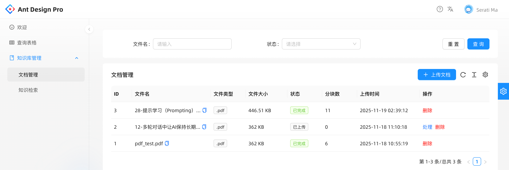
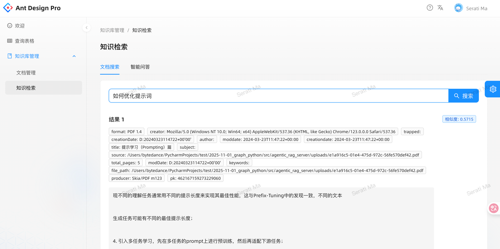

前置： 修改`langgraph_teach/easy_rag_server/agentic_rag_server/config.py`中的`MILVUS_URI`和`EMBEDDING_BASE_URL`替换为你真实部署的服务

依赖安装和部署就不叙述了

## 效果及功能展示

文档上传及管理

基于知识库的内容检索和agent整合后的内容检索

agent整合，如何知识库中不存在相关内容，则会告知用户而不会自己胡编乱造

